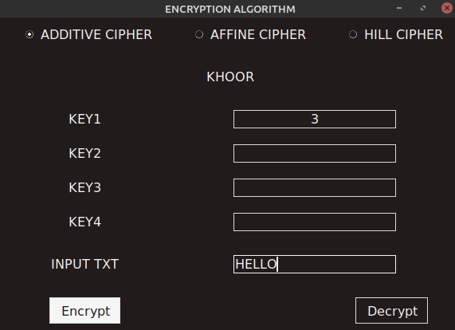
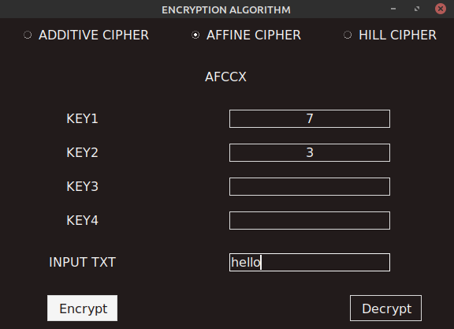
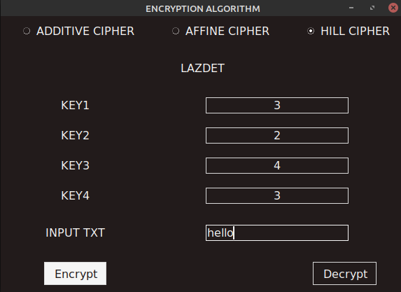
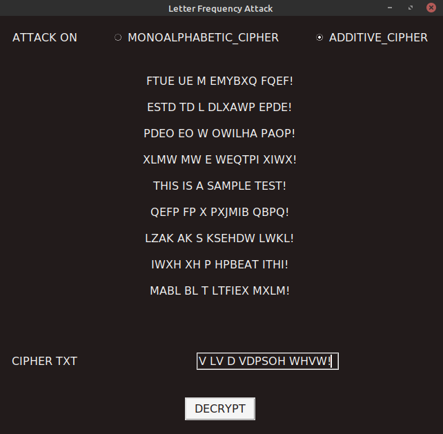
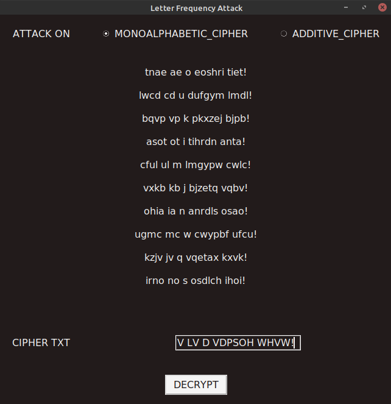

# SUBSTITUTION CIPHERS

  ---

## Description

A GUI program with the following functionalities:
- Encryption and Decryption of text using:
  - Additive Cipher
  - Affine Cipher
  - 2x2 Hill Cipher 
- Letter Frequency attack on 
  - Additive Cipher
  - Monoalphabetic Substitution Cipher

### Technology

- python3
---

## Usage

### Installation

Installing tkinter module if not present 
```
pip3 install tk
```
For linux users
```
apt-get install python3-tk
```
### Examples

#### Ciphers

```
python3 cipherMa1in.py
```
**Key1** is required for Additive Cipher




**Key1** and **Key2** are required for Affine Cipher

  


**All Keys** required for 2 x 2 Hill Cipher

  


#### Letter Frequency Attack

```
python3 attackMain.py
```

Gives **10 possible** plain texts

**Attack on Additive Cipher**


**Attack on Monoalphabetic Substitution Cipher**


---

## License

Licensed under [MIT License](license)


